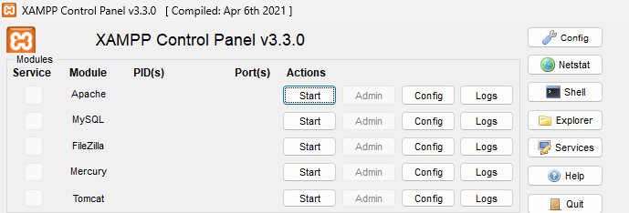
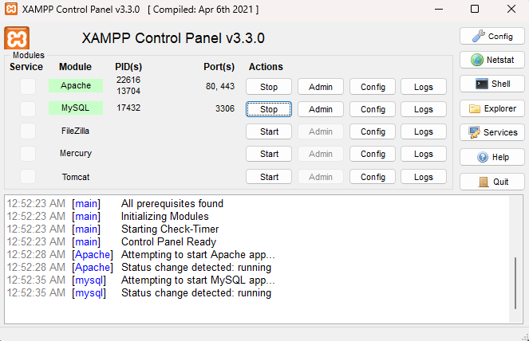
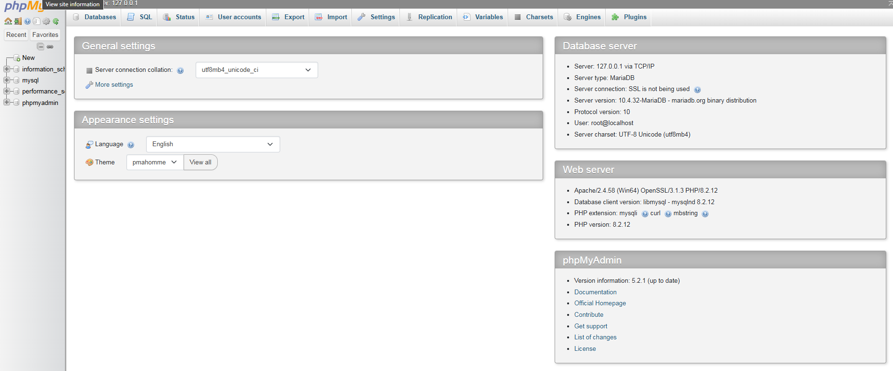
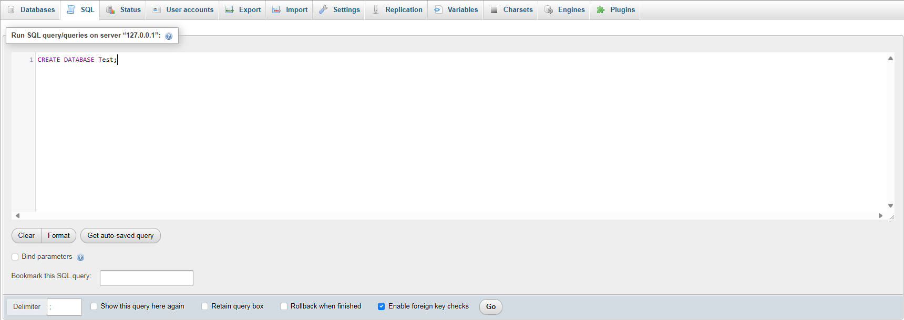
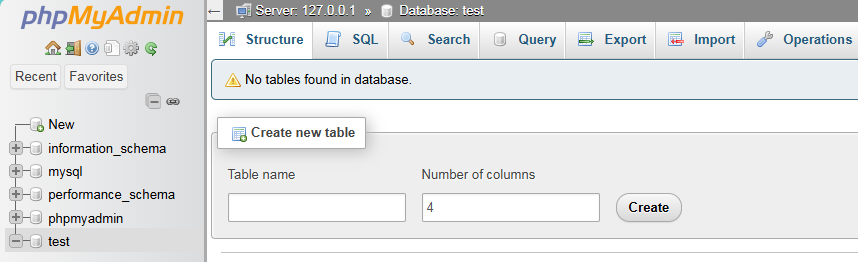

## Install XAMPP
[XAMPP](https://www.apachefriends.org/)

### Open XAMPP control panel

### Start Apache & Mysql

### Localhost page through Mysql Admin

## CREATE DATABASE

Syntax --> CREATE DATABASE databasename;

Created

