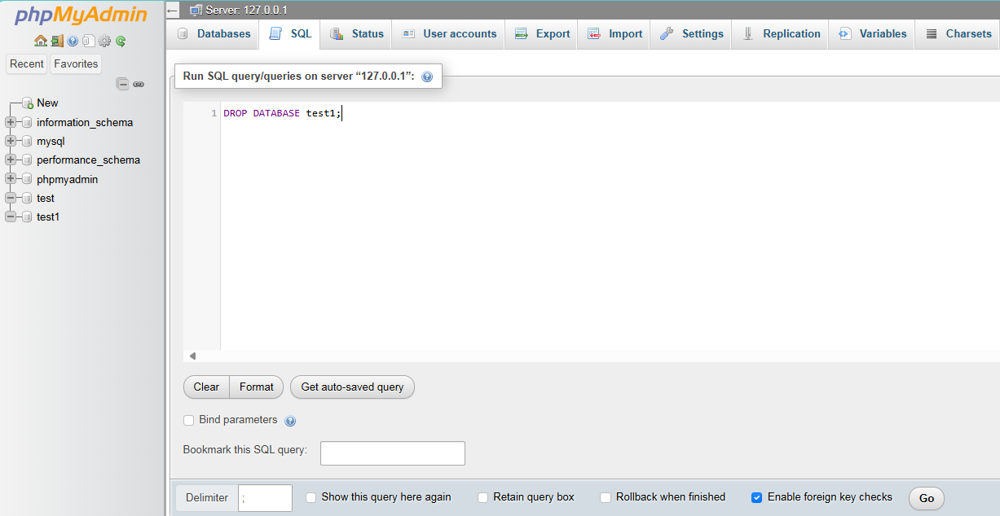
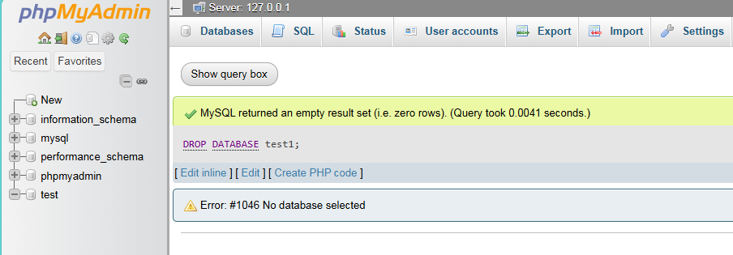
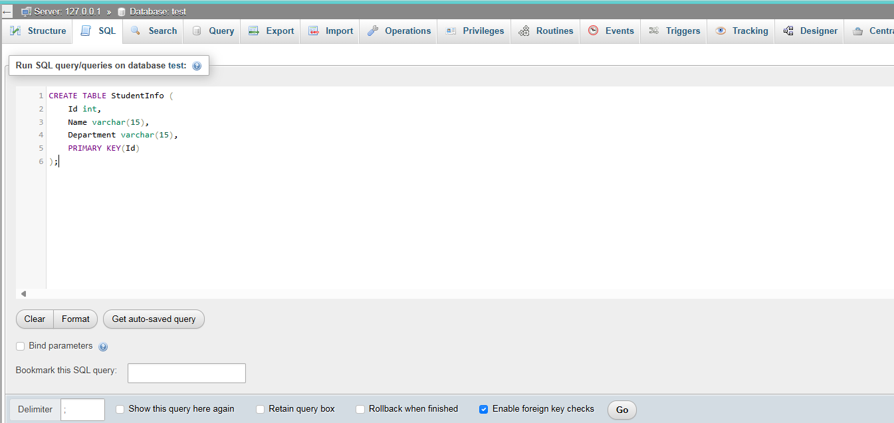
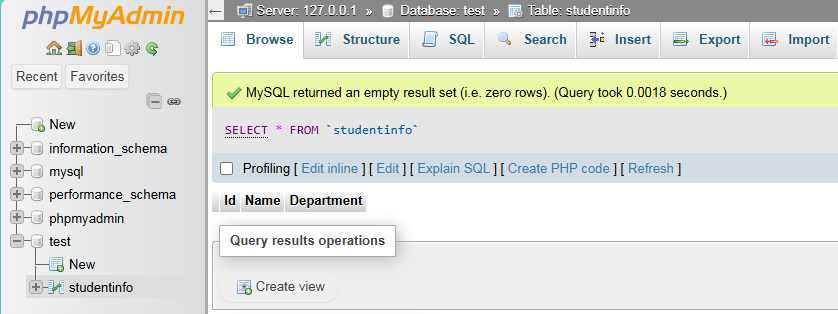

## Install XAMPP
[XAMPP](https://www.apachefriends.org/)

## Open XAMPP control panel

## Start Apache & Mysql

## Localhost page through Mysql Admin

## CREATE DATABASE

### Syntax --> CREATE DATABASE databasename;

### Created  

## DROP DATABASE

### Syntax --> DROP DATABASE databasename;

### Dropped  

## CREATE TABLE

### syntax --> CREATE TABLE table_name (column1 datatype, column2 datatype, ....);

### Table Created

