## Install XAMPP
[XAMPP](https://www.apachefriends.org/)

## Open XAMPP control panel
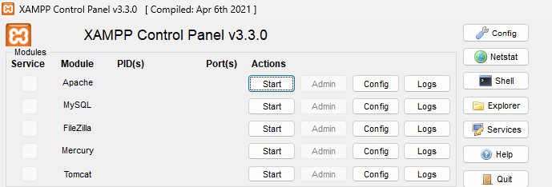

## Start Apache & Mysql
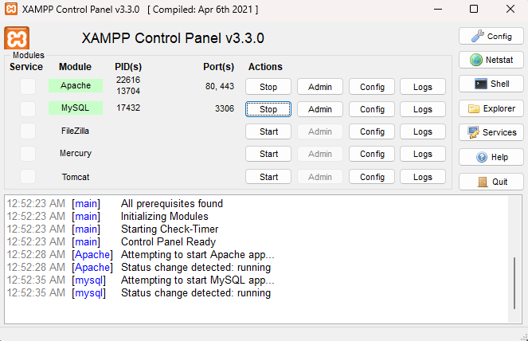

## Localhost page through Mysql Admin
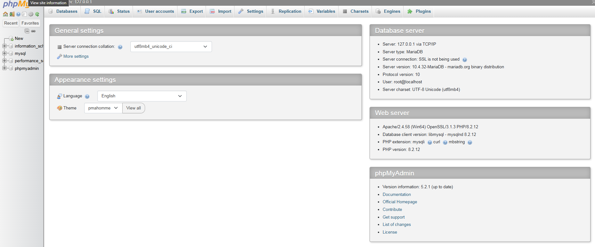

## CREATE DATABASE
CREATE DATABASE statement is used to create a new SQL database.

### Syntax --> CREATE DATABASE databasename;
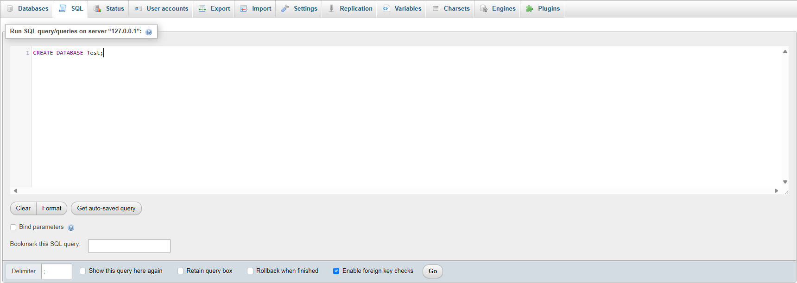
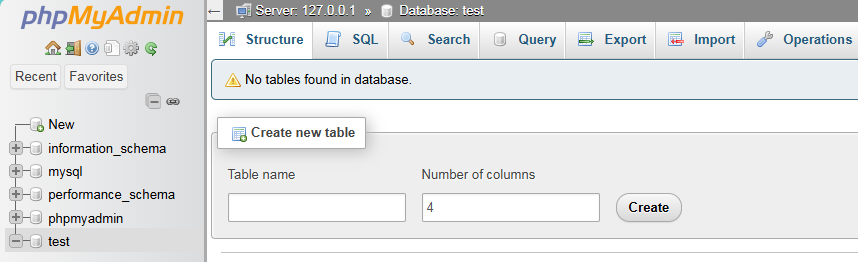

## DROP DATABASE
DROP DATABASE statement is used to drop an existing SQL database.

### Syntax --> DROP DATABASE databasename;
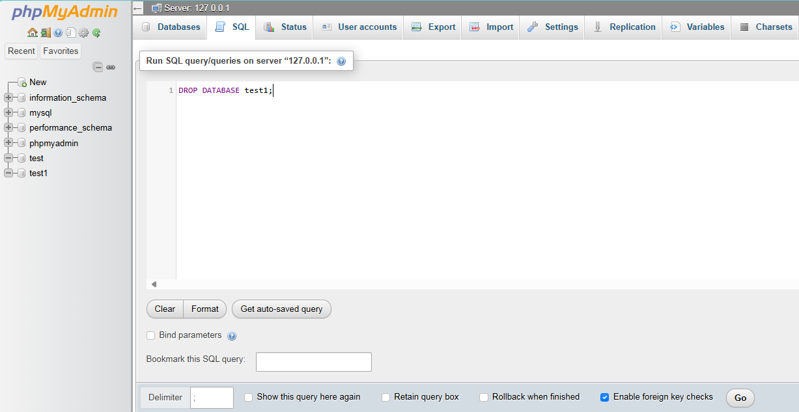
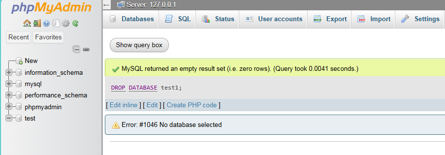

## CREATE TABLE
CREATE TABLE statement is used to create a new table in a database.

### syntax --> CREATE TABLE table_name (column1 datatype, column2 datatype, ....);
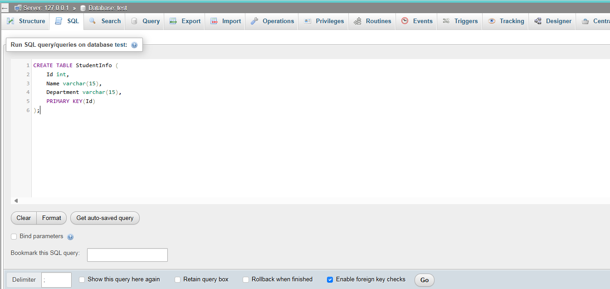
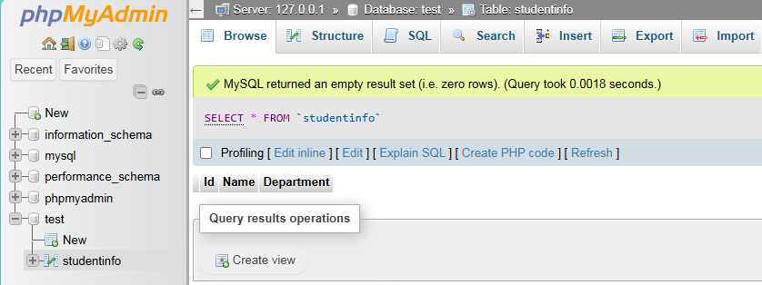

## INSERT INTO
INSERT INTO statement is used to insert new records in a table.

### syntax --> INSERT INTO table_name (column1, column2, column3, ...)VALUES (value1, value2, value3, ...);
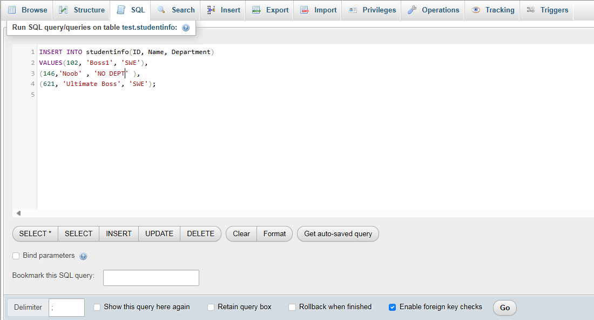
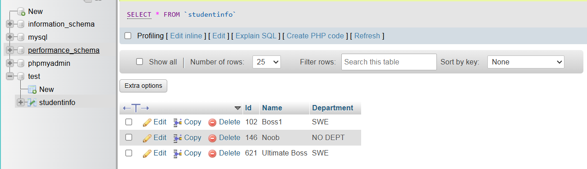

## SELECT
Select statement is used to select data from a database.

### syntax --> SELECT column1, column2, ...FROM table_name;
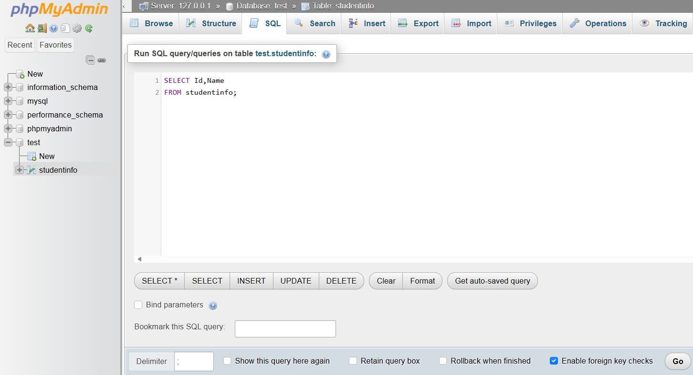
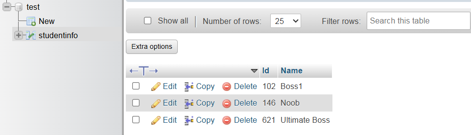

### If anyone want to select all the fields available in the table, than syntax is: SELECT * FROM table_name;
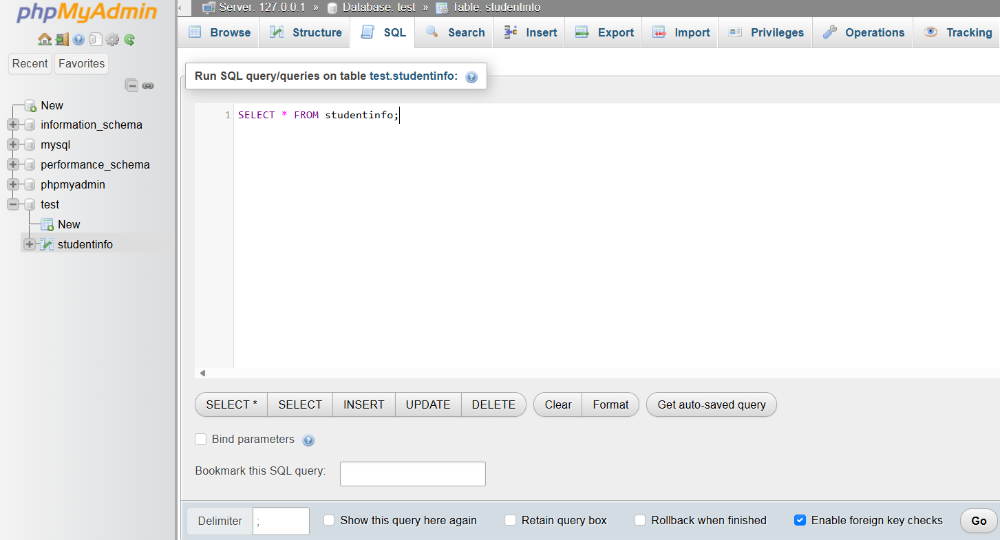
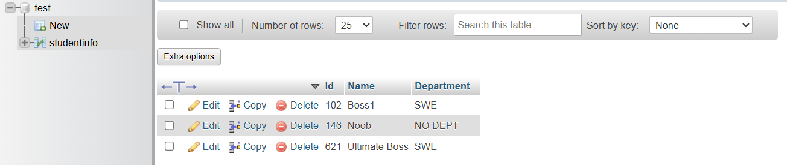

## SELECT DISTINCT
This SQL statement selects only the DISTINCT values

### syntax --> SELECT DISTINCT Column1,column2,... FROM table_name;
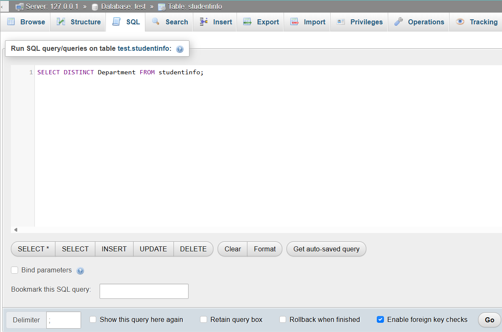
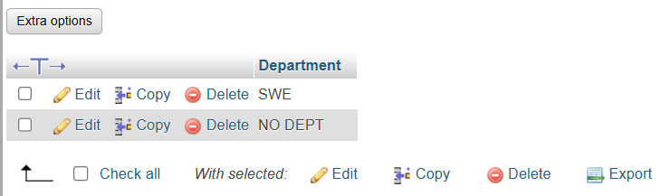

## LIMIT
LIMIT is used to specify the number of records to return.

### syntax --> SELECT column_name(s) FROM table_name LIMIT number; or SELECT * FROM table_name LIMIT number;
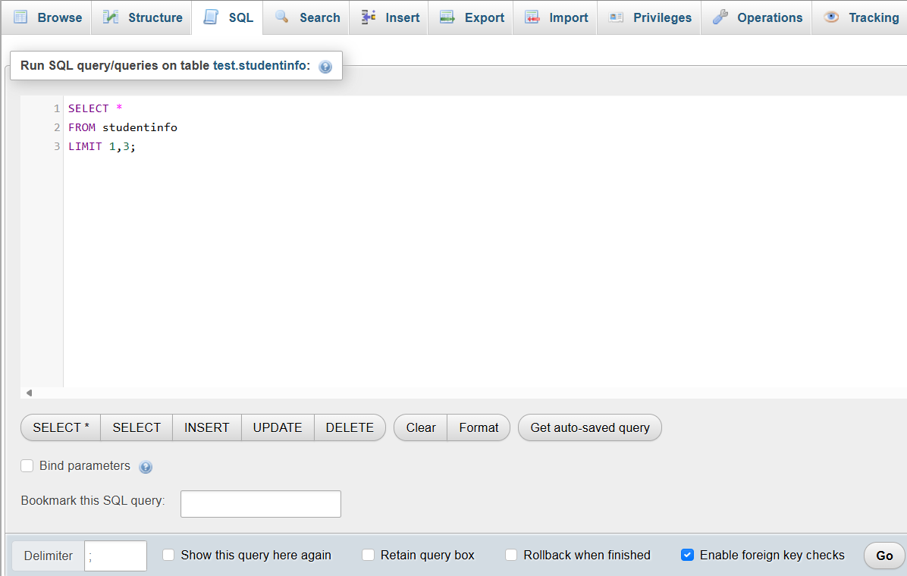

## ORDER BY
ORDER BY keyword is used to sort the result-set in ascending or descending order.

For ascending order 
### syntax --> SELECT column1, column2, ... FROM table_name ORDER BY column1, column2, ...;
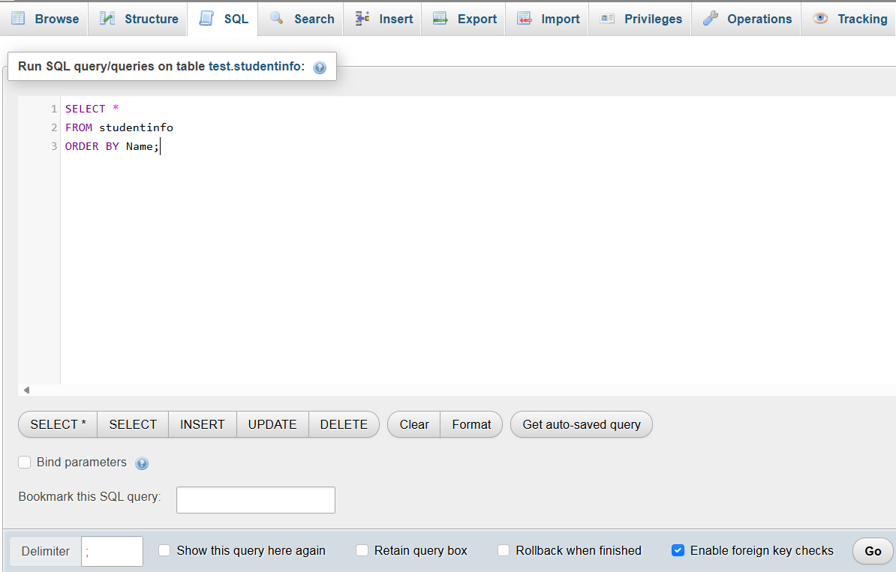
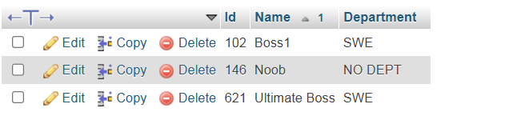

For descending order
### syntax --> SELECT column1, column2, ... FROM table_name ORDER BY column1, column2, ... DESC;
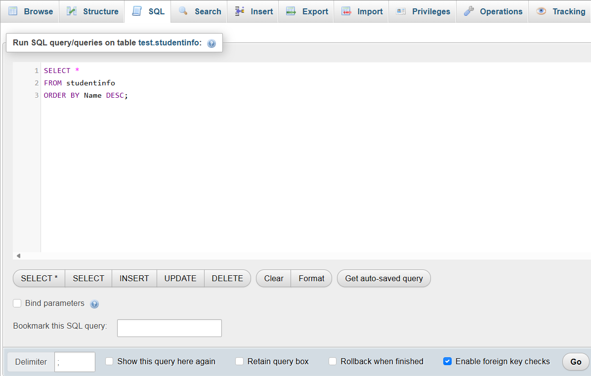
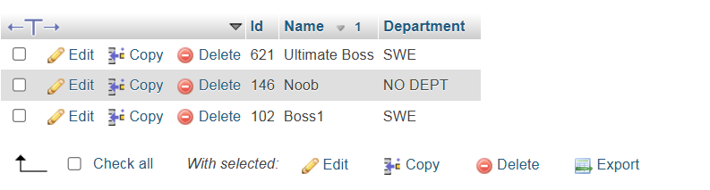