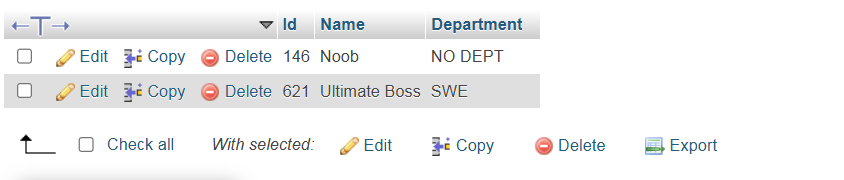

## Install XAMPP
[XAMPP](https://www.apachefriends.org/)

## Open XAMPP control panel

## Start Apache & Mysql

## Localhost page through Mysql Admin

## CREATE DATABASE
CREATE DATABASE statement is used to create a new SQL database.

### Syntax --> CREATE DATABASE databasename;

## DROP DATABASE
DROP DATABASE statement is used to drop an existing SQL database.

### Syntax --> DROP DATABASE databasename;

## CREATE TABLE
CREATE TABLE statement is used to create a new table in a database.

### syntax --> CREATE TABLE table_name (column1 datatype, column2 datatype, ....);

## INSERT INTO
INSERT INTO statement is used to insert new records in a table.

### syntax --> INSERT INTO table_name (column1, column2, column3, ...)VALUES (value1, value2, value3, ...);

## SELECT
Select statement is used to select data from a database.

### syntax --> SELECT column1, column2, ...FROM table_name;

### If anyone want to select all the fields available in the table, than syntax is: SELECT * FROM table_name;

## SELECT DISTINCT
This SQL statement selects only the DISTINCT values

### syntax --> SELECT DISTINCT Column1,column2,... FROM table_name;

## LIMIT
LIMIT is used to specify the number of records to return.

### syntax --> SELECT column_name(s) FROM table_name LIMIT number; or SELECT * FROM table_name LIMIT number;

## ORDER BY
ORDER BY keyword is used to sort the result-set in ascending or descending order.

For ascending order 
### syntax --> SELECT column1, column2, ... FROM table_name ORDER BY column1, column2, ...;

For descending order
### syntax --> SELECT column1, column2, ... FROM table_name ORDER BY column1, column2, ... DESC;

## WHERE Clause
WHERE clause is used to filter records.

### syntax --> SELECT column1, column2, ... FROM table_name WHERE condition;

WHERE clause can be combined with AND, OR, and NOT operators.

### syntax --> SELECT column1, column2, ... FROM table_name WHERE condition1 AND condition2 AND condition3 ...;

### syntax --> SELECT column1, column2, ... FROM table_name WHERE condition1 OR condition2 OR condition3 ...;

## IN operator
IN operator allows you to specify multiple values in a WHERE clause.

### syntax --> SELECT column_name FROM table_name WHERE column_name IN (value1, value2, ...);

## LIKE Operator
LIKE operator is used in a WHERE clause to search for a specified pattern in a column.

WHERE  LIKE 'a%'	Finds any values that start with "a" 
WHERE  LIKE '%a'	Finds any values that end with "a" 
WHERE  LIKE '%or%'	Finds any values that have "or" in any position 
WHERE  LIKE '_r%'	Finds any values that have "r" in the second position 
WHERE  LIKE 'a_%'	Finds any values that start with "a" and are at least 2 characters in length 
WHERE  LIKE 'a__%'	Finds any values that start with "a" and are at least 3 characters in length 
WHERE  LIKE 'a%o'	Finds any values that start with "a" and ends with "o" 

### syntax --> SELECT column1, column2, ... FROM table_name WHERE columnN LIKE pattern;

## AS keyword
The AS command is used to rename a column or table with an alias.

### syntax --> SELECT Column1 AS new_name, Column2 AS new_name, ..... FROM table_name;